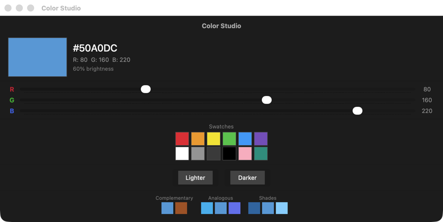
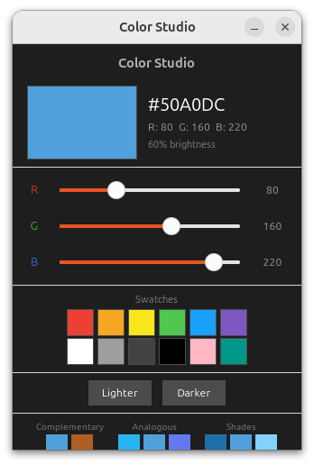
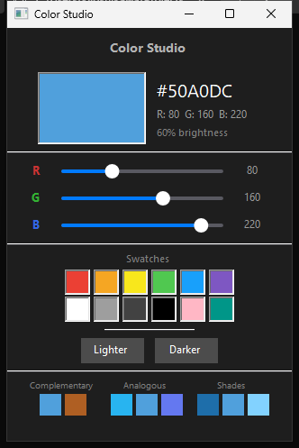
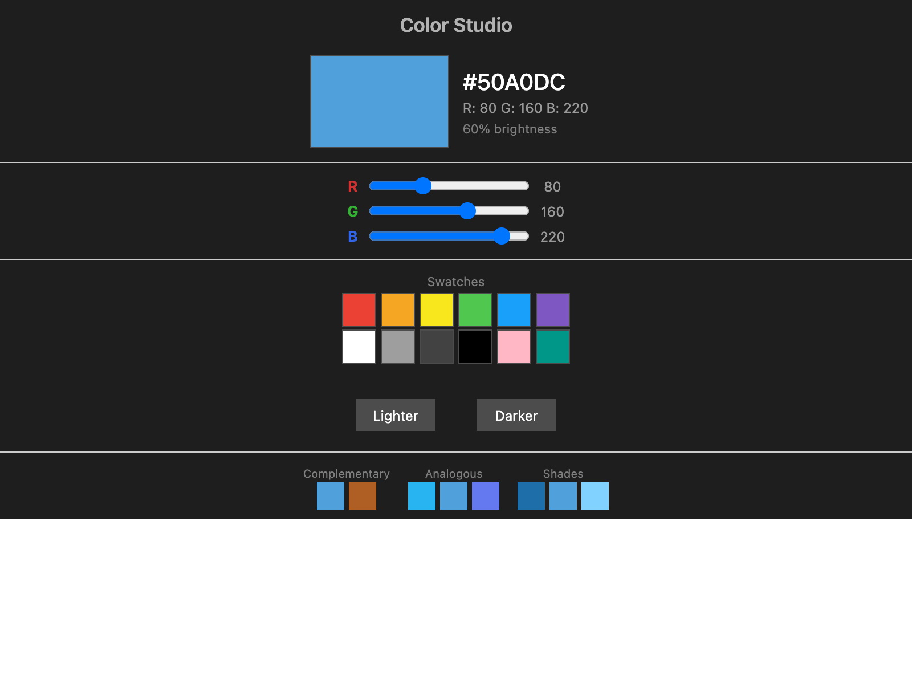

# SwiftOpenUI

Write SwiftUI, run anywhere.

A cross-platform SwiftUI framework that renders natively on macOS, Linux, Windows, and the Web — from a single Swift codebase.

## Color Studio — one codebase, four platforms

| macOS (SwiftUI) | Linux (GTK4) |
|:---:|:---:|
|  |  |
| **Windows (Win32)** | **Web (Wasm)** |
|  |  |

> Same Swift code. Native rendering on each platform. No electron, no webview wrappers.

## Platform Support

| Platform | Backend | Status | Views | Modifiers |
|----------|---------|--------|-------|-----------|
| macOS | SwiftUI (native) | Reference | All | All |
| Linux | GTK4 | Production | 43/44 | 36/38 |
| Windows | Win32 + D2D | Production | 43/44 | 36/38 |
| Web | Wasm + DOM | Near-parity | 42/44 | 36/38 |
| Android | Compose | Phase 2 | 14/44 | 22/38 |

## Quick Start

```bash
# Clone
git clone https://github.com/codelynx/SwiftOpenUI.git
cd SwiftOpenUI

# Run on macOS (uses real SwiftUI)
swift run HelloWorld
swift run Stopwatch
swift run ColorMixer

# Run on Linux (GTK4)
sudo apt install libgtk-4-dev
swift run ColorMixer

# Run in browser (Wasm)
./web/run.sh ColorMixer
```

For detailed per-platform setup (prerequisites, toolchains, Vite, GTK4 packages, Visual Studio), see the **[Getting Started Guide](docs/guides/getting-started.md)**.

## Examples

### Showcase

Polished mini-apps demonstrating what you can build:

| Example | Command | Description |
|---------|---------|-------------|
| HelloWorld | `swift run HelloWorld` | Minimal app — Text with padding |
| Stopwatch | `swift run Stopwatch` | Timer, start/stop, lap times |
| ColorMixer | `swift run ColorMixer` | Color picker with sliders, swatches, harmony |
| Calculator | `swift run Calculator` | Grid/GridRow calculator with arithmetic logic |

### Parity

Matrix-backed coverage screens — one per feature category:

```bash
swift run ParityViewsBasic        # Text, Button, TextField, Color, Spacer, Divider
swift run ParityViewsLayout       # VStack, HStack, ZStack, ForEach, Group
swift run ParityViewsContainers   # Toggle, Slider, Image, ScrollView, List
swift run ParityModifiers         # padding, frame, colors, font, border, opacity
swift run ParityStateData         # @State, @Binding, @ObservedObject, @StateObject
swift run ParityNavigation        # NavigationStack, NavigationLink, NavigationPath
swift run ParityEnvironment       # @Environment, @EnvironmentObject, custom keys
swift run ParityGestures          # onTapGesture, onLongPressGesture, onDrag
swift run ParityAnimation         # .animation(), withAnimation()
swift run ParityFocus             # @FocusState, .focused()
swift run ParityAppStructure      # App, Scene, WindowGroup, @ViewBuilder
```

## What's Implemented

### Views (43 of 44)
Text, Button, TextField, Toggle, Slider, Image, Color, Spacer, Divider, VStack, HStack, ZStack, Group, ForEach, List, ScrollView, AnyView, EmptyView, NavigationStack, NavigationLink, SecureField, TextEditor, ProgressView, Stepper, Label, Link, TabView, Grid, GridRow, DisclosureGroup, Form, Section, LazyVStack, LazyHStack, LazyVGrid, LazyHGrid, Picker, DatePicker, GeometryReader, Menu, ConfirmationDialog, Canvas, NavigationSplitView

### Modifiers (36 of 38)
.padding(), .frame(), .foregroundColor(), .foregroundStyle(), .background(), .font(), .border(), .opacity(), .offset(), .scaleEffect(), .animation(), .imageScale(), .onTapGesture(), .onLongPressGesture(), .onDrag(), .environmentObject(), .environment(), .navigationTitle(), .navigationDestination(), .focused(), .modifier(), withAnimation(), .cornerRadius(), .shadow(), .rotationEffect(), .overlay(), .sheet(), .alert(), .confirmationDialog(), .onAppear(), .searchable(), .toolbar(), .gridCellColumns(), .pickerStyle(), .navigationSplitViewColumnWidth(), .onDisappear()

### State Management
@State, @Binding, @ObservedObject, @StateObject, @EnvironmentObject, @Published, @Environment, @FocusState, @Observable, ObservableObject

## Architecture

```
+-----------------------------------------------------+
|  Examples (import SwiftUI on macOS, SwiftOpenUI else)|
+-----------------------------------------------------+
|  SwiftOpenUI Core                                    |
|  View, State, Layout, Modifiers, Environment         |
+--------------+---------------+---------------+-------------+
|  BackendGTK4 |  BackendWin32 |  BackendWeb   | BackendDroid|
|  GTKRenderer |  WinRenderer  |  WebRenderer  | AndroidRend.|
|  GTKViewHost |  Win32ViewHost|  WebViewHost  | AndroidHost |
+--------------+---------------+---------------+-------------+
|  CGTK        |  CWin32       |  JavaScriptKit|  JNI        |
|  CGTKBridge  |  CWin32Bridge |  (DOM API)    |  Compose    |
+--------------+---------------+---------------+-------------+
```

The core library (`Sources/SwiftOpenUI/`) is platform-independent with zero platform imports. All GTK/Win32/Web code lives in `Sources/Backend/`. Backends implement rendering via protocol extensions (`GTKRenderable`, `WinRenderable`, `WebRenderable`).

## Building

| Platform | Prerequisites | Build | Test |
|----------|--------------|-------|------|
| macOS | Xcode CLI tools | `swift build` | `swift test` |
| Linux | `libgtk-4-dev` | `swift build` | `swift test` |
| Windows | Swift toolchain | `swift build` | `swift test` |
| Web | [swiftly](https://github.com/swiftlang/swiftly) + Wasm SDK | `./web/run.sh HelloWorld` | N/A |

### Xcode

```bash
brew install xcodegen
cd apple/Examples && xcodegen generate
open Examples.xcodeproj
```

## Documentation

| Doc | Description |
|-----|-------------|
| [Feature Parity Matrix](docs/architecture/swiftui-parity-matrix.md) | Per-backend implementation status |
| [Running Examples](docs/guides/running-examples.md) | Build and run on all platforms |
| [Adding a Backend](docs/guides/adding-a-backend.md) | How to implement a new backend |
| [Web Setup](docs/guides/web-setup.md) | Wasm build, Vite, DOM mapping |
| [Platform Notes](docs/porting/platform-notes.md) | Platform quirks and workarounds |
| [Web Parity Plan](docs/plans/web-parity-plan.md) | Web backend gap analysis |

## Contributing

1. Pick a view or modifier from the [parity matrix](docs/architecture/swiftui-parity-matrix.md)
2. Add the core definition in `Sources/SwiftOpenUI/Views/` or `Modifiers/`
3. Add backend rendering in each renderer (see [adding a backend](docs/guides/adding-a-backend.md))
4. Add tests in `Tests/SwiftOpenUITests/`
5. Add coverage to the appropriate parity example

## License

MIT License. See [LICENSE](LICENSE) for details.
