# Screenshots

Cross-platform screenshot comparison for SwiftOpenUI examples.

## Structure

```
screenshots/
├── linux/      ← GTK4 (captured via gnome-screenshot)
├── macos/      ← Native SwiftUI (captured via CGWindowID + screencapture)
├── windows/    ← Win32/D2D (captured via GDI+ CopyFromScreen)
└── web/        ← Browser/Wasm
```

## Capturing

### macOS

```bash
# Capture all examples
./screenshots/capture-macos.sh

# Capture one example
./screenshots/capture-macos.sh HelloWorld
```

Uses a compiled Swift helper (`window-capture.swift`) to find the CGWindowID by PID, then `screencapture -l` for the window, then `sips` to scale to 50% (Retina 2x → 1x). Requires Screen Recording permission for VS Code or Terminal.

### Linux

```bash
# Capture all examples
./screenshots/capture-linux.sh

# Capture one example
./screenshots/capture-linux.sh HelloWorld
```

Requires `gnome-screenshot` and a running display server (X11 or Wayland).

### Windows

```powershell
# Capture all examples
.\screenshots\capture-windows.ps1

# Capture one example
.\screenshots\capture-windows.ps1 HelloWorld
```

Uses Win32 `FindWindow` + GDI+ `CopyFromScreen` to capture by window title. Saves as PNG. No external tools needed.

## Naming Convention

Screenshots are named to match example numbers:

| File | Example | Command |
|------|---------|---------|
| `01-HelloWorld.png` | HelloWorld | `swift run HelloWorld` |
| `02-TextStyles.png` | TextStyles | `swift run TextStyles` |
| `03-Buttons.png` | Buttons | `swift run Buttons` |
| `04-State.png` | State | `swift run StateDemo` |
| `05-Layout.png` | Layout | `swift run Layout` |

## Cross-Platform Comparison

All examples use the same Swift source (`main.swift`) with `#if os(macOS)` to select SwiftUI vs SwiftOpenUI. The view code is identical — only the platform's native rendering differs.

### 01-HelloWorld

| macOS (SwiftUI) | Linux (GTK4) | Windows (Win32) |
|-----------------|-------------|-----------------|
| 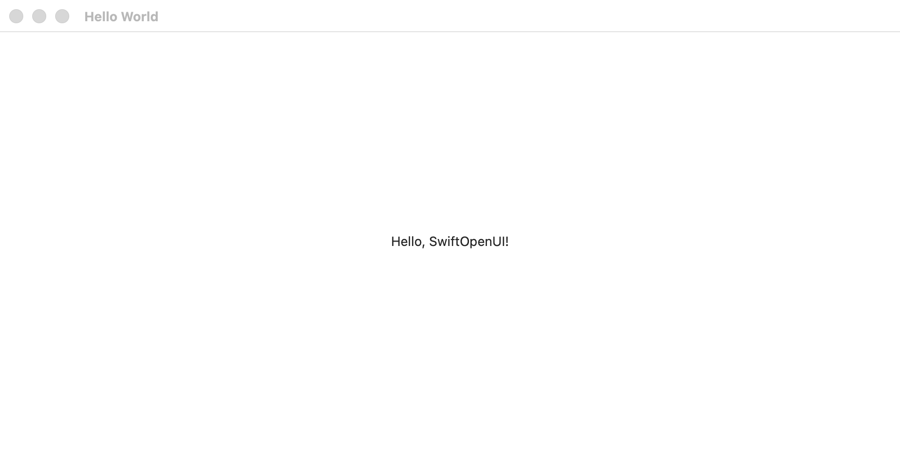 | 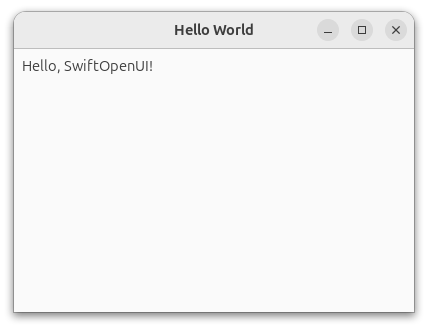 | 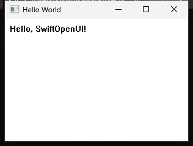 |

- macOS: centered text, native SwiftUI window chrome
- Linux: left-aligned text, GTK4 header bar
- Windows: left-aligned text, Win32 title bar

### 02-TextStyles

| macOS (SwiftUI) | Linux (GTK4) | Windows (Win32) |
|-----------------|-------------|-----------------|
| 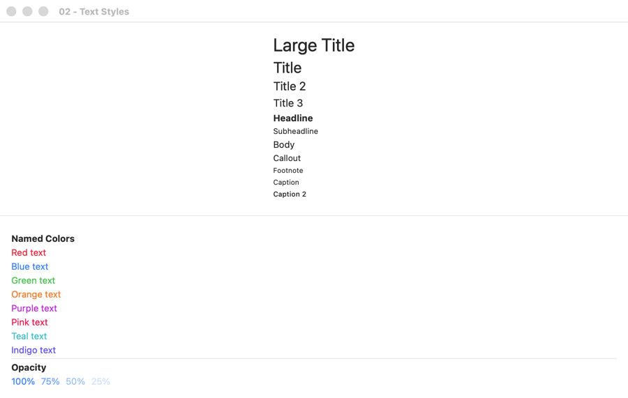 | 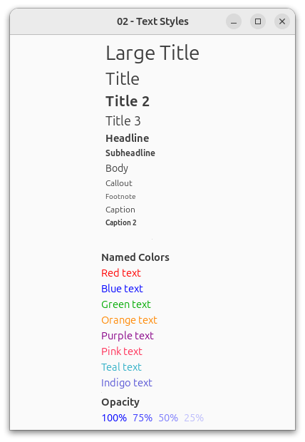 | 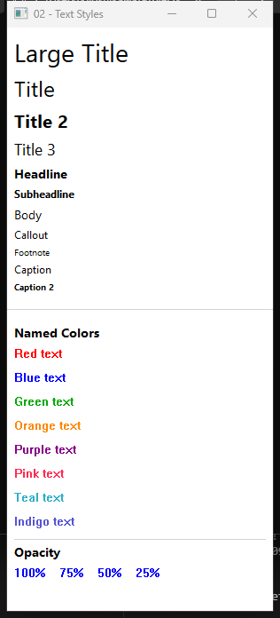 |

- All font sizes render correctly across platforms
- Named colors match well (red, blue, green, orange, purple, pink, teal, indigo)
- Opacity gradient visible on all platforms
- Font metrics differ slightly (platform-native typefaces)

### 03-Buttons

| macOS (SwiftUI) | Linux (GTK4) | Windows (Win32) |
|-----------------|-------------|-----------------|
| 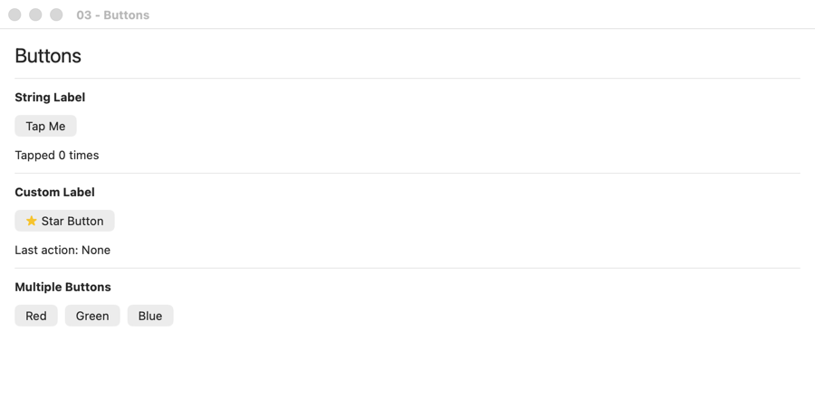 | 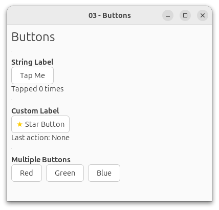 | 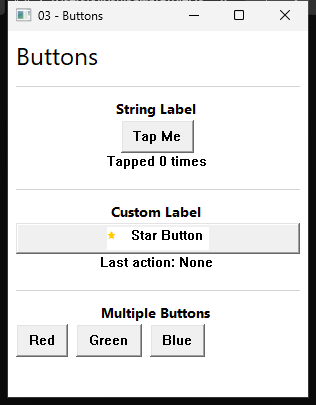 |

- Button styling is platform-native (rounded on macOS, GTK theme on Linux, flat on Windows)
- Custom label buttons (star emoji) render on all platforms
- Multiple buttons in HStack layout correctly

### 04-State

| macOS (SwiftUI) | Linux (GTK4) | Windows (Win32) |
|-----------------|-------------|-----------------|
| 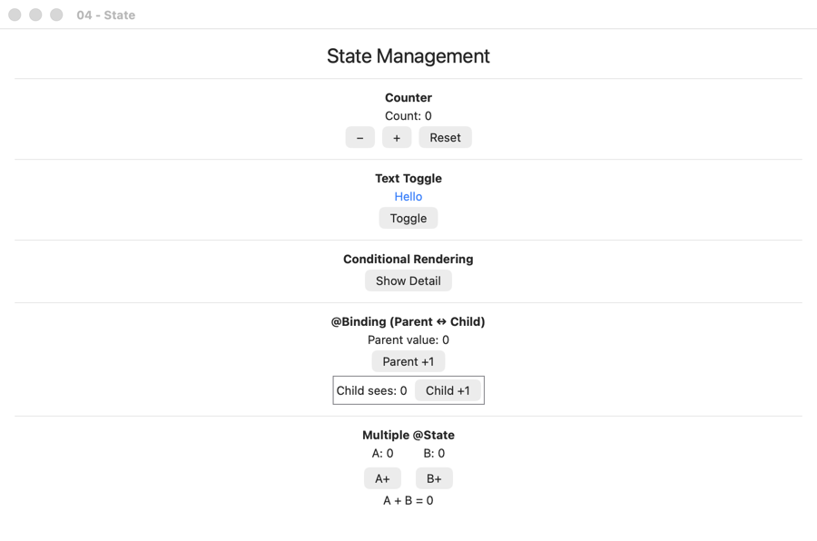 | 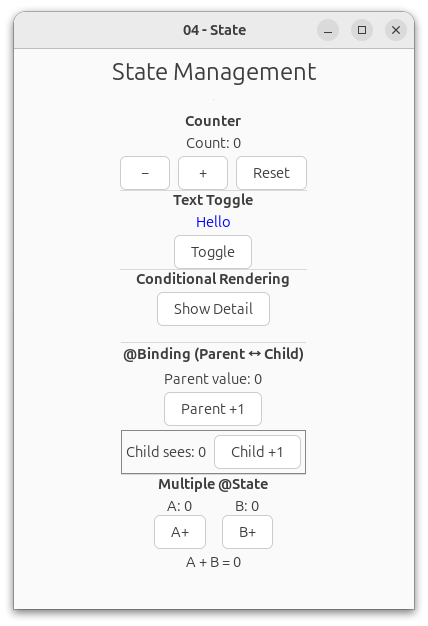 | 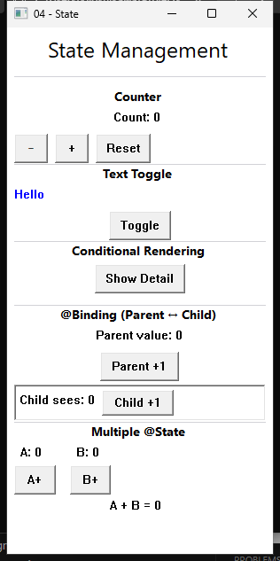 |

- Counter, text toggle, conditional rendering, @Binding, multiple @State all present
- Linux closely matches macOS layout
- Windows layout is slightly looser but functionally correct

### 05-Layout

| macOS (SwiftUI) | Linux (GTK4) | Windows (Win32) |
|-----------------|-------------|-----------------|
| 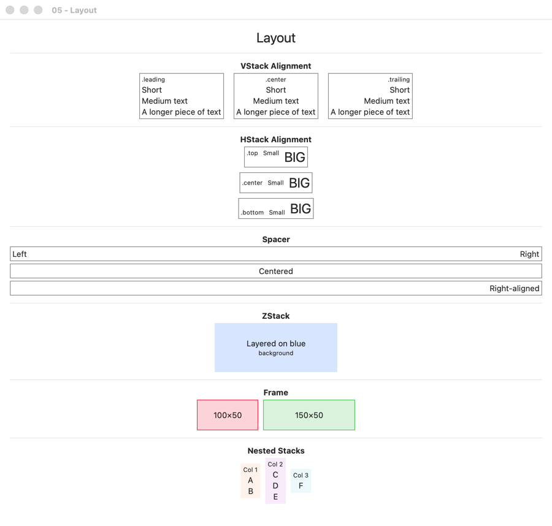 | 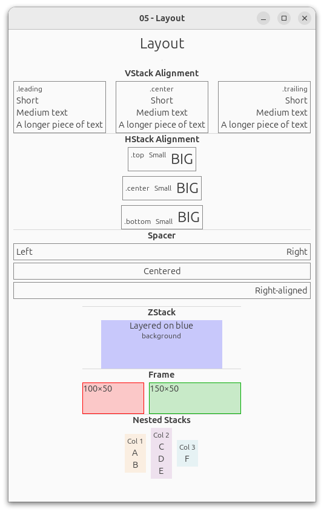 | 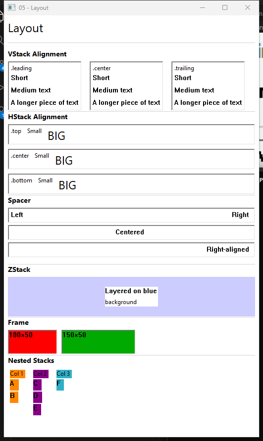 |

- VStack alignment (.leading, .center, .trailing) works on all platforms
- HStack alignment (.top, .center, .bottom) works on macOS and Linux; Windows has some alignment differences
- Spacer pushes content correctly on all platforms
- ZStack layering with blue background renders on all platforms
- Frame sizing (100x50, 150x50) correct on macOS and Linux; Windows frame rendering needs refinement
- Nested stacks render on all platforms with minor spacing differences

### Summary

| Aspect | macOS | Linux | Windows |
|--------|-------|-------|---------|
| Text rendering | Native SF | Native GTK font | Direct2D |
| Font sizes | All correct | All correct | All correct |
| Colors | All correct | All correct | All correct |
| Button styling | Rounded, native | GTK theme | Flat, Win32 |
| VStack/HStack | Precise | Close match | Some alignment gaps |
| ZStack | Correct | Correct | Correct |
| Spacer | Correct | Correct | Correct |
| Frame | Correct | Correct | Needs refinement |
| @State reactivity | Works | Works | Works |
| @Binding | Works | Works | Works |

**Overall:** The same Swift source renders functionally correct on all 3 platforms with platform-native look and feel. Windows has some layout rough edges compared to macOS and Linux.
